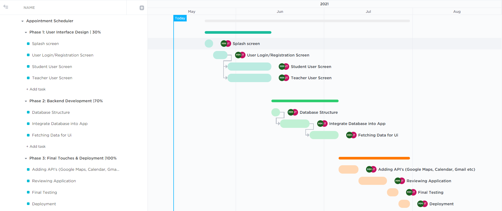

# appointment_scheduler
Expected Project Timeline
=========================

For better view click [here](https://sharing.clickup.com/g/h/4-5913085-7/7b4763f58e1af03)

## Report on Learning Pre-requisites
-------------------------------------

SL | Learning Task | Description | Status | Comment |
--:|:-------------:|:-----------:|:------:|:-------:|
1  | Flutter       | Flutter Widgets, Dart Language |   | |
2 | Firebase | Authentication, Real-Time Database, Data Fetching |    | |
3 | API's | Google Maps, Google Calender, Gmail |  | |
4 | Push Notifications | Alarm, In-device Notification |  | |
